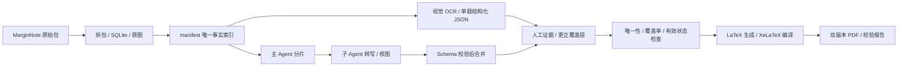

# MarginNote → OCR → Agent 复核 → LaTeX：多元积分实例

一个包含真实历史工作数据、可追溯更正和双版本 PDF 的本地实例项目。输入 MarginNote `.marginpkg`，恢复数据库知识树与原始题图，按题调用视觉 OCR，检查唯一性、完整性和复核状态，再生成可编辑 LaTeX 与做题本。

这是已完成的 **题干工作流实例**：391 道题、401 张题图、514 张关联摘录、391 份结构化 OCR JSON，以及无空版和留空版 PDF。答案摘录仍待分类，答案 OCR / 答案排版尚未执行。可以直接阅读现有 PDF，也可以不接入任何 API，离线检查和重建本实例。

## 1. 流程与职责



- **拆包工具**恢复目录顺序，导出数据库原始 PNG；不靠文件名猜题号。
- **OCR**只忠实转写 `images.question`，不解题、不从答案补条件。
- **主 Agent**分配互不重叠的题目，收集候选结果，统一检查和排版。
- **子 Agent**只处理分配题目，按 Schema 提交 JSON，遇到不确定处明确标记。
- **复核者**把结论和本地图片证据写入 `json/manual/fixups.json`；不依赖覆盖原始 OCR。
- **最终检查**拒绝重复 ID、缺失结果、图像顺序变化和未关闭的 OCR 问题。

Agent 是执行职责，可交给你使用的编程助手或人工协作者。项目提供分片与合并协议，**不会自动连接某个 Agent 平台，也不会自动启动子 Agent**。`run_ocr.py --workers` 是并发 API 调用，与多 Agent 编排分开。完整分工和可复制提示词见 [Agent 工作说明](docs/AGENT_WORKFLOW.md)。

## 2. 本实例的完成范围

| 项目 | 状态 |
|---|---|
| 目录树 / 数据库 / 媒体拆包 | 已完成并校验 |
| 题图 / 关联图导出 | 401 / 514 张，无缺失 PNG |
| 题干 OCR | 391 份，全部可按 Schema 校验 |
| 原始模型状态 | 385 `ok`、6 `needs_review`，原始结果保留 |
| 应用人工覆盖后的状态 | 391 `ok` |
| 人工覆盖记录 | 7 条，含保护既有微元更正的记录 |
| 无空版 / 留空版 | 58 / 80 页，正文 54 / 76 页 |
| 答案分类 / 答案 OCR | 未开始，关联摘录不能直接当成答案 |
| 语义重复题判断 | 未执行；ID 唯一不等于题意互不重复 |

题目分布：空间解析几何 113、三重积分 44、线面积分 234。

正式交付在 [output/pdf](output/pdf/)。本次整理的实际验证记录见 [VALIDATION.md](VALIDATION.md)。原始历史交付说明见 [docs/history/original-delivery-README.md](docs/history/original-delivery-README.md)，历史说明中的状态和命令不能替代本 README。

## 3. 目录结构

```text
.
├── README.md / LICENSE / DATA-NOTICE.md
├── .gitattributes                 Git LFS 规则
├── .gitignore                     凭据、配置、虚拟环境、运行临时文件
├── requirements.txt
├── config/                        不含凭据的 OCR / 字体示例
├── source/                        原始 marginpkg + 解包 SQLite marginnotes
├── manifest.json                  稳定 ID、目录路径、题源、图片顺序
├── tree.json / outline.md          机器目录树 / 人读目录
├── extraction-report.json          拆包来源、SHA-256、CRC 与数量
├── img/question/                  题干原始 PNG
├── img/related/                   答案候选或题干续页，保持分开
├── json/ocr/question/             原始 OCR JSON
├── json/manual/fixups.json         人工更正与复核证据索引
├── work/ocr-ai/                   忠实转写提示词与 JSON Schema
├── work/review/                   图片核对与补齐证据
├── work/logs/                     历史验证与本实例检查报告
├── tex/                           可编辑 TeX、插图、编译日志和历史视觉 QA
├── output/pdf/                    当前正式 PDF 与交付校验报告
├── tools/                         自包含 Python 工具
├── tests/                         OCR / 分片 / 覆盖层的离线回归测试
├── docs/                          Agent 协议、归档来源和数据说明
├── archives/                      原始拆包 ZIP + 脱敏 OCR 交付快照
└── runs/                          新执行日志 / 分片 / 候选，Git 忽略
```

两个历史归档会重复包含部分数据，这是为了保留既有交付快照。`archives/extraction-original.zip` 保持原始字节；OCR 交付快照重新打包并清除历史连接敏感配置。归档哈希和脱敏文件位置见 [archive-inventory.json](docs/history/archive-inventory.json)。不要把历史归档中的旧执行器当成现行入口，当前入口统一在 `tools/`。

## 4. 安装与离线快速开始

推荐 Python 3.11–3.13；本地交付使用 Python 3.13 验证。Python 依赖只用于图像、Schema 和 PDF 检查，OCR 网络请求使用标准库。

在仓库根目录打开 PowerShell：

```powershell
python -m venv .venv
.\.venv\Scripts\python.exe -m pip install -r requirements.txt
.\.venv\Scripts\python.exe tools/check_project.py
.\.venv\Scripts\python.exe tools/check_upload.py
.\.venv\Scripts\python.exe tools/run_ocr.py --dry-run
.\.venv\Scripts\python.exe -m unittest discover -s tests -v
```

Linux/macOS：将上面 Python 路径改为 `.venv/bin/python`。不必激活虚拟环境，因此无需修改 PowerShell 执行策略。

`check_project.py` 会检查数据库、全量图片、原始/有效 OCR、题号顺序、章节书签、编译日志及正式 PDF 哈希，并写入 `work/logs/project-check.json`。只检查数据而暂时跳过 PDF：

```powershell
python tools/check_project.py --skip-pdf
```

克隆时如果没有安装 Git LFS，拿到的可能是小型指针文件，不能作为图片、数据库或 PDF 使用。先执行 `git lfs install` 和 `git lfs pull`。

## 5. 从原始 MarginNote 包重新拆包

原始包位于 `source/`，解包数据库路径由 `manifest.json` 指定。重新拆包请输出到一个**不存在的新目录**，避免覆盖当前实例和历史更正：

```powershell
python tools/export_package.py "source/多元积分完整题库（含答案）(2026-09-30-12-28-06).marginpkg" "../multivariate-reextracted"
```

拆包恢复 SQLite 目录树，区分主卡题图和合并摘录，执行 CRC、数据库完整性、哈希、唯一 ID、图像解码与字节一致性检查。新目录是拆包成果，不会自动携带当前项目的人工更正和版式。

## 6. OCR 配置与执行

需要支持图片输入且兼容 `/chat/completions` 的服务。默认不绑定任何学校网关、代理或模型。

```powershell
Copy-Item config/ocr.example.json config/ocr.json
```

编辑 `config/ocr.json`，把 `base_url` 改为接口基址（通常以 `/v1` 结尾），`model` 改为实际视觉模型。`proxy` 默认为 `null`；只有实际需要 HTTP 代理时才填写代理地址。可通过 `OCR_BASE_URL`、`OCR_MODEL`、`OCR_PROXY` 覆盖配置。

API 密钥仅从环境变量 `OCR_API_KEY` 读取，不写入 JSON、README 或日志。PowerShell 可用隐藏输入临时设置：

```powershell
$ocrSecret = Read-Host "OCR API key" -AsSecureString
$env:OCR_API_KEY = [System.Net.NetworkCredential]::new('', $ocrSecret).Password
python tools/run_ocr.py --limit 5 --workers 1
Remove-Item Env:OCR_API_KEY
```

本实例已有 391 份可用结果，普通执行会跳过它们，不需要 API 密钥。检查任务但不发网络请求：

```powershell
python tools/run_ocr.py --dry-run
```

重跑前五题、全量并发、指定起点：

```powershell
python tools/run_ocr.py --limit 5 --force
python tools/run_ocr.py --workers 4
python tools/run_ocr.py --start 100 --limit 10 --force
```

`--start` 是 manifest 的 **0 起始索引**，不是显示题号。`--limit 0` 表示处理到末尾；`--max-attempts` 默认 3。模型输出先经过 Schema、ID、图像顺序、控制字符与类型检查，再原子替换单题文件。格式错误或失败结果不会写入正式 OCR；有不确定标记的 `ok` 会降为 `needs_review`。自动跳过已校验且非 `failed` 的结果，`needs_review` 留给复核者处理。

执行日志在 `runs/`，不包含密钥、HTTP 响应正文或模型原始输出。整个写入运行持有 `runs/writer.lock`，避免两个写入器同时覆盖。崩溃后确认无任务运行，再手工移除陈旧锁。

`--force` 会替换原始 OCR，但**不会修改人工覆盖层**。如需撤销已确认更正，必须明确编辑 `json/manual/fixups.json`，并重新核图。

## 7. Agent / 子 Agent 分工与唯一性检查

生成三个互不重叠的任务文件：

```powershell
python tools/agent_tasks.py plan --shards 3 --out runs/agent-plan
```

把每个 `shard-XX.json`、`work/ocr-ai/prompt.md`、Schema 和对应题图交给一个子 Agent。每道题输出 `<item_id>.json`，写到自己负责的 `runs/candidates/shard-XX/`。不要让子 Agent 修改正式 OCR、manifest、数据库或覆盖层。

主 Agent 收齐候选后合并：

```powershell
python tools/agent_tasks.py merge --plan runs/agent-plan/plan.json --input runs/candidates/shard-01 --input runs/candidates/shard-02 --input runs/candidates/shard-03 --force
python tools/check_project.py
```

本实例已有正式 OCR，因此示例合并使用 `--force`。合并前完整检查任务覆盖、重复分配、未知/重复结果、缺失结果、Schema、ID 和图片顺序。任何预检查失败都不会写入正式数据。通过后逐文件原子替换；多文件合并不是数据库事务，写入中断后可重新执行已审核的合并。覆盖层始终保留。`needs_review` 候选可以合并，但最终发布检查会拒绝其未关闭状态。

唯一性检查对象是 `qid`、`item_id`、`seq`、结果归属和覆盖率。不同来源的语义相同题目不会被自动删掉。

## 8. 人工更正与证据

不改源数据库、图片或原始 OCR。每个覆盖项以 `item_id` 为键，只覆盖需要更正的字段，`_review` 描述核图结论，`_evidence` 使用仓库内相对路径。以下为格式示意，不应直接加入实际题库：

```json
{
  "ITEM_ID": {
    "status": "ok",
    "latex": "核图确认后的 LaTeX",
    "flags": [],
    "_review": "逐图确认公式，说明更正依据",
    "_evidence": "work/review/ITEM_ID-source.png"
  }
}
```

`flags` 应仅移除已由证据解决的疑点；图形和文字层冲突等事实标记应继续保留。`possible_answer_content` 在本实例表示输入图中混有答案内容，是来源提示；排版只使用 `latex/options`，不编入逐图转写。一个源图只有积分式的题目已根据既有核图结论关闭状态，不为它添加原图没有的要求。缺失第二问的题目使用仓库内第311页证据，历史微元更正也固定到覆盖层，避免重跑丢失。

## 9. LaTeX 与两版 PDF 重建

需安装完整 TeX Live 或相应 MiKTeX 宏包，并让 `xelatex` 在 PATH。使用 `ctex`、`fontspec`、`tikz`、`esint` 等项目模板所用宏包；不需要从 API 调用 OCR 才能排版。

```powershell
python tools/typeset/build_books.py
python tools/typeset/compile_books.py
python tools/check_project.py
```

构建会覆盖生成的 TeX 与 PDF。人工内容更正请修改覆盖层，版式请修改 `tools/typeset/` 或模板，避免只手改生成文件。封皮先编译，两本正文各编译两次，随后校验并同步到 `output/pdf/`；报告不会把自动检查冒充新的逐页视觉复核。

Windows 默认封皮字体是 Microsoft YaHei / SimSun，正文由 ctex 自动选择。Linux/macOS 默认封皮使用 TeX Live 的 Fandol 字体。需要统一跨平台字体时：

```powershell
Copy-Item config/fonts.example.json config/fonts.json
```

示例选用 Fandol；可填写安装在系统/TeX 中的字体名及 ctex 字体集。不同字体、TeX 版本和驱动可能改变页数、换行和 PDF 哈希；重建后以新的报告为准，重新看关键页面。实例中的三张图裁剪框与个别公式换行是题库专用设置。

## 10. 上传 GitHub：先启用 LFS

本目录包含超过 100 MiB 的数据库、源包和历史 ZIP，不能通过普通网页逐文件上传。已提供 `.gitattributes`，数据库、源包、归档、图像和 PDF 都使用 Git LFS。

```powershell
git init -b main
git lfs install
git add .
git status --short
git lfs ls-files
git commit -m "Add reproducible MarginNote OCR LaTeX example"
```

在 GitHub 创建一个空仓库（避免自动生成 README），再填写你自己的 URL：

```powershell
git remote add origin https://github.com/YOUR_ACCOUNT/YOUR_REPOSITORY.git
git push -u origin main
```

也可以在已经登录 GitHub CLI 的情况下创建私人仓库并推送：

```powershell
gh repo create YOUR_REPOSITORY --private --source=. --remote=origin --push
```

完整数据与历史快照占用较大 LFS 存储和下载量，上传前按账户实际额度安排。需要缩小公开仓库时，可以把历史 ZIP 放到 Release 资产，保留下载链接和 SHA-256；现交付目录按保留全部历史数据准备。

本项目已配置 Git LFS 存储规则。凭据、本机配置与新运行临时文件默认忽略；已有历史日志、证据和交付快照保留。上传时先检查已有远程配置，避免重复添加 origin。

## 11. 许可与限制

工具代码与题库资料分开声明，详见 [LICENSE](LICENSE) 和 [DATA-NOTICE.md](DATA-NOTICE.md)。完整数据实例建议先使用私人仓库；公开再分发依实际资料授权范围处理。

本实例的 OCR 网络执行器已通过本地模拟服务测试，但没有在整理过程中调用付费或内部 OCR 服务。接口的模型能力、请求体限制与计费以你配置的服务为准。ID/Schema/编译检查不能证明每一道公式在语义上都正确，严谨使用仍依赖原图与复核证据。

GitHub 官方参考：[大文件限制](https://docs.github.com/en/repositories/working-with-files/managing-large-files/about-large-files-on-github)、[Git LFS](https://docs.github.com/en/repositories/working-with-files/managing-large-files/about-git-large-file-storage)。
